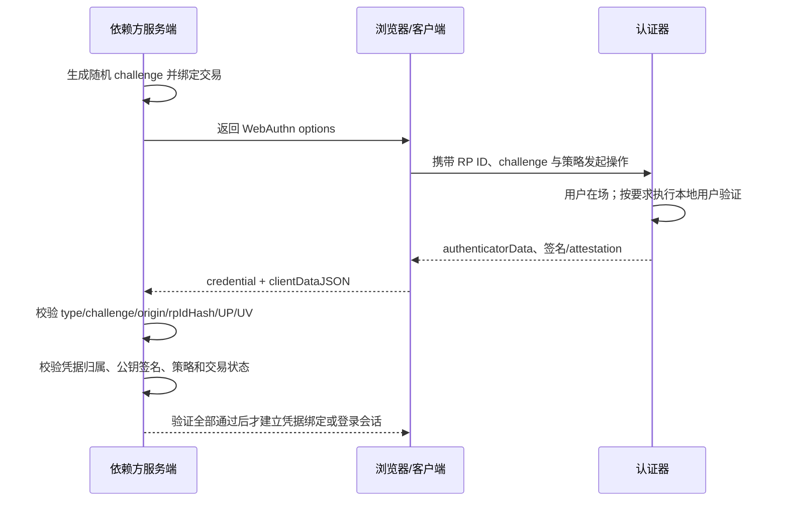

# 定义

Passkey 是基于 FIDO 标准的公钥认证凭据；在 Web 场景中，依赖方通过 WebAuthn API 发起注册和认证 ceremony。认证器保存私钥，依赖方只保存公钥及凭据元数据，并用一次性 challenge 和签名证明用户控制相应私钥。

WebAuthn 的安全不来自“浏览器弹出了生物识别窗口”，而来自依赖方服务端完整验证：

- 本次响应属于服务端刚发起的交易；
- 请求来自预期 origin，并绑定到预期 RP ID；
- 用户在场，且在策略要求时完成了本地用户验证；
- 响应由已绑定到该账号的凭据私钥签名；
- 新凭据绑定、删除和账号恢复没有绕过现有认证强度。

# 边界

属于本技术的情况：

- WebAuthn 注册和认证的依赖方服务端校验。
- passkey 的同步型与设备绑定型差异。
- UP、UV、attestation、`signCount`、Backup Eligible / Backup State 的安全含义。
- 新增、删除、失窃处置和账号恢复。

不属于或不能单独解决的情况：

- WebAuthn 不是授权模型，登录成功后仍要逐请求执行服务端授权。
- passkey 不会自动修复 XSS、会话固定、Cookie 配置、恶意浏览器扩展或终端失陷。
- 本地生物识别是认证器激活方式，不代表服务器获得或验证了生物模板。
- attestation 不是一般消费级应用的默认准入清单。
- 认证 ceremony 抗钓鱼，不代表短信、客服或邮件恢复路径也抗钓鱼。

容易混淆的相邻概念：

- `WebAuthn`：浏览器 API 和依赖方—认证器公钥认证协议。
- `CTAP`：客户端平台与外部/跨设备认证器之间的协议。
- `FIDO2`：通常指 WebAuthn 与 CTAP 组合。
- `passkey`：面向用户的 FIDO 无密码凭据术语，通常以可发现凭据提供用户名无关或用户名优先的体验。
- `UP`：用户在场或明确交互；不等于本地身份已验证。
- `UV`：认证器用 PIN、生物特征等完成本地用户验证；依赖方仍须检查返回标志。

# 核心安全不变量

1. challenge 由受信任的服务端使用密码学随机源生成，至少具备规范要求的不可猜测性，短时保存并绑定到具体 ceremony、账号或登录上下文。
2. 每个 challenge 只能授权一次有效结果；过期、错配、已消费或跨会话的响应一律失败。
3. 依赖方从服务端固定配置取得允许的 origin 与 RP ID，不能相信请求体、Host 头或前端回传的期望值。
4. 注册成功前必须完成完整验证，再把 credential ID、公钥和账号建立唯一绑定。
5. 认证时必须证明 credential ID 属于当前账号；用户名无关流程还必须验证 `userHandle` 与凭据归属一致。
6. 如果业务把本次认证视为多因素密码学认证，必须请求并验证 UV；仅 UP 不足以支持该结论。
7. 签名必须用该 credential ID 对应的已存公钥验证，签名覆盖 authenticator data 与 `clientDataJSON` 哈希。
8. 新增、替换、删除认证器与账号恢复是高风险认证事件，不能只依赖当前 Cookie 或更弱的后备通道。
9. 同步型凭据与设备绑定型凭据必须按实际保证能力分级，不能只看界面上的“passkey”名称。
10. WebAuthn 成功后仍须创建和保护普通应用会话；会话安全和敏感操作再认证不能省略。

# 信任边界与流程

浏览器 API 成功只表示客户端拿到了一个响应。最终认证决定必须由依赖方服务端作出，前端布尔值、设备名称或 UI 文案都不能替代密码学验证。

# 注册 ceremony

## 发起前

- 用户已通过与新增凭据风险匹配的认证。已有高强度认证器时，不得仅凭长期会话新增 passkey。
- 服务端生成新 challenge，绑定用户、ceremony 类型、预期 origin、RP ID、过期时间和一次性状态。
- `user.id` 使用稳定、不可猜测且不含邮箱/用户名等个人信息的内部 user handle。
- `pubKeyCredParams` 只列出服务端实际支持和会验证的算法。
- 需要多因素语义时，将 `userVerification` 设为 `required`；`preferred` 不能保证每次返回 UV。
- `excludeCredentials` 可阻止同一账号重复注册已知凭据，但不能替代服务端唯一约束。
- attestation 默认按隐私和兼容性选择 `none`；只有明确的企业设备/合规准入策略才请求并验证 attestation。

## 服务端必须验证

1. 响应结构是注册响应，`clientDataJSON.type` 为 `webauthn.create`。
2. 返回 challenge 与本次服务端保存值精确匹配，交易未过期、未消费且上下文一致。
3. `clientDataJSON.origin` 与允许列表中的完整 origin 精确匹配；不做子串、后缀或正则宽匹配。
4. authenticator data 中 `rpIdHash` 等于预期 RP ID 的 SHA-256。
5. UP 已设置；如果本次策略要求用户验证，UV 也已设置。
6. 凭据公钥算法是本次 `pubKeyCredParams` 中允许的算法。
7. 扩展输出符合本次请求和本地策略；未知可选扩展按明确策略忽略或拒绝。
8. attestation statement 的格式、签名和信任路径按策略验证；允许 none 时也要完成格式和 authenticator data 校验。
9. credential ID 没有绑定到其他账号，并由数据库唯一约束兜底。
10. 全部验证通过后，才原子地保存 credential ID、公钥、账号、初始 `signCount`、注册时间和必要元数据，并消费 challenge。

建议保存但不直接作为信任结论的字段包括 transports、AAGUID、attestation 结果、UV、Backup Eligible 和 Backup State。保存这些字段要有用途、保留期限和隐私说明。

# 认证 ceremony

## 账号优先流程

用户先提供账号标识时，服务端可把该账号已绑定的 credential ID 放入 `allowCredentials`。返回的 credential ID 必须仍属于该账号；不能因为浏览器返回了一个有效签名，就把签名者映射到请求中的任意账号。

## 用户名无关流程

`allowCredentials` 为空时，认证器可返回可发现凭据及 `userHandle`。服务端必须：

- 要求 `userHandle` 存在；
- 用 `userHandle` 找到账号；
- 验证 credential ID 也绑定到同一账号；
- 不把前端提交的用户名作为覆盖映射。

## 服务端必须验证

1. credential ID 存在，并按上面的流程属于被认证账号。
2. 响应结构是认证响应，`clientDataJSON.type` 为 `webauthn.get`。
3. challenge 与本次服务端交易精确匹配，未过期、未消费且上下文一致。
4. origin 与允许列表精确匹配。
5. `rpIdHash` 等于预期 RP ID 的 SHA-256。
6. UP 已设置；策略要求多因素或本地用户验证时，UV 已设置。
7. 扩展输出符合请求和本地策略。
8. 使用 credential ID 对应的已存公钥，验证 `signature` 对 `authenticatorData || SHA-256(clientDataJSON)` 的签名。
9. 比较 `signCount`；异常进入风险判断、告警或加强验证，而不是把它当作唯一的克隆定论。
10. 全部验证成功后，原子消费 challenge，再建立新的服务端会话并按认证强度记录会话上下文。

# challenge 与重放防护

- W3C Level 2 要求 challenge 由依赖方在受信任环境随机生成，建议至少 16 字节。
- challenge 必须保存在服务端或采用等价的完整性保护状态，不能由客户端生成后原样相信。
- 注册与认证使用不同 ceremony 类型；同一 challenge 不能跨类型、跨账号或跨会话复用。
- challenge 的业务状态应包含用途、主体、签发时间、过期时间和消费状态。
- 多实例部署需要共享的原子消费机制，避免两个并发请求同时通过。
- 日志记录 challenge 的内部交易 ID 或哈希即可，不记录可重放的完整响应包。

# origin 与 RP ID

- origin 包含 scheme、host 和 port；RP ID 是域名范围，不包含 scheme 或 port。
- 依赖方应显式配置生产、预发布和本地开发的允许 origin，环境之间不要共用宽泛通配。
- RP ID 可以覆盖同一注册域下的多个 origin，但扩大 RP ID 范围会扩大可使用凭据的站点范围，必须按组织域边界审慎选择。
- 不能用 `endsWith("example.com")` 代替域边界判断；`evil-example.com` 也会命中这种错误逻辑。
- 反向代理后的外部 origin 应来自可信部署配置，而不是未经约束的 `X-Forwarded-*` 或 Host。

# UP、UV 与“生物识别”

- UP 表示认证器检测到用户在场或交互，支持认证意图。
- UV 表示认证器在本地用 PIN、生物特征或其他方法验证了用户。
- 生物样本和模板通常留在本地认证器；依赖方只验证认证器返回的 UV 与签名。
- `userVerification: preferred` 是体验偏好，不是安全保证。需要 UV 时必须请求 `required`，并在服务端拒绝 UV 未设置的响应。
- 设备解锁动作是否满足某个合规体系的第二因素要求，取决于认证器属性、激活方式和适用规范，不能仅凭 UI 推断。

# 同步型与设备绑定型 passkey

同步型 passkey：

- 私钥可经同步体系以受保护形式复制到多个设备。
- 仍通过 RP ID 绑定提供抗钓鱼能力，并可满足适当配置下的 AAL2 场景。
- 信任边界扩大到 passkey provider、同步账号、恢复流程和所有接收密钥的设备。
- NIST SP 800-63B-4 明确指出同步密钥具有可导出性，因此不能用于 AAL3。

设备绑定型 passkey：

- 设计目标是私钥不离开特定认证器或硬件安全密钥。
- 可能适合更高保证场景，但“设备绑定”标签本身不能证明 AAL3。
- 高保证结论还需要非导出密钥、硬件隔离、批准的密码技术、认证器能力证据和组织政策。

WebAuthn Level 3 的 Backup Eligible 与 Backup State 可帮助识别凭据是否允许备份及当前备份状态。Level 3 截至 2026-07-20 仍是 Candidate Recommendation；依赖方应把这些字段作为策略输入，而不是跨平台绝对保证。

# `signCount` 的正确使用

- 认证器可以维护每凭据或全局签名计数器，也可以始终返回零。
- 当新值不大于已存非零值时，可能存在凭据复制，也可能是认证器故障或同步行为。
- 计数异常应产生结构化风险事件，可结合设备变化、恢复事件和会话风险决定告警、加强验证或拒绝。
- 不能把 `signCount == 0` 直接判成漏洞，也不能把单次下降直接写成“已确认私钥泄露”。

# attestation 的边界

attestation 可为认证器型号、制造来源和能力提供可验证证据，但会增加：

- 信任根、证书状态和元数据维护成本；
- 设备兼容性与注册失败；
- 认证器可识别性和隐私风险；
- 策略过期后误拒绝安全设备的风险。

面向公众的服务通常接受 none attestation。企业托管设备、受监管环境或必须限制认证器型号的场景，才根据明确威胁模型维护允许的 attestation 格式、信任根、撤销和降级策略。

# 凭据生命周期与账号恢复

## 新增或替换

- NIST 要求新增认证器时，使用“账号当前可达到的最高 AAL”和“新认证器目标 AAL”两者中的较低者完成认证。
- 仅有已登录 Cookie 不足以支持静默新增高价值认证器。
- 新增后通过独立于该交易的渠道通知用户，并提供快速撤销入口。
- 鼓励用户绑定至少两种独立认证手段，降低失去单个设备后走弱恢复的概率。

## 删除、失窃与撤销

- 删除最后一个强认证器前执行再认证和明确确认。
- 用户报告设备丢失、被盗或凭据疑似泄露时，应能立即解除该 credential ID 的账号绑定。
- 记录操作者、时间、来源会话、凭据内部标识和处置结果，但不记录私钥、完整 assertion 或生物信息。

## 恢复

- 恢复不是便利功能，而是另一条认证协议；强度不能长期低于正常登录而不被风险接受。
- 保存型恢复码至少使用足够随机性、哈希存储、限速、单次使用，并在使用后轮换。
- 客服恢复需要可审计的身份核验、职责分离和高风险账号升级流程，不能依赖安全问题。
- 恢复、新增凭据和联系方式变更均触发独立通知；高价值账号可增加延迟或二次复核。
- 恢复完成后检查并撤销失效凭据和高风险会话，而不是只添加一个新 passkey。

# 成因模型

- 信任边界：依赖方服务端、浏览器/客户端、认证器、同步体系、账号恢复渠道、应用会话。
- 可控输入：credential ID、`clientDataJSON`、authenticator data、签名、`userHandle`、扩展输出和代理头。
- 危险操作：绑定新凭据、把签名映射到账号、签发登录会话、删除认证器、执行账号恢复。
- 缺失控制：交易绑定、origin/RP ID 校验、凭据归属校验、UV 策略、签名验证、原子 challenge 消费、恢复再认证和独立通知。

# 安全验证

仅在本地、测试或明确授权环境执行以下低影响回归：

- 修改 challenge、type、origin 或 RP ID 后，服务端必须拒绝且不建立会话。
- 重放同一注册或认证响应，第二次必须失败。
- 使用属于账号 A 的 credential ID 请求登录账号 B，必须失败。
- 用户名无关流程返回不一致 `userHandle` 与 credential ID 时，必须失败。
- 策略要求 UV 时，用只设置 UP 的响应必须失败。
- 签名、公钥算法或 credential ID 任一错配时，必须失败。
- 重复注册同一 credential ID 到另一账号时，数据库与业务层均应阻止。
- 新增/删除 passkey 只持有旧会话但未再认证时，必须失败。
- 恢复完成后，独立通知、旧凭据处置和会话风险动作均应可观察。
- `signCount` 为零时按兼容策略处理；非零计数回退时产生风险信号而非无依据的固定结论。

停止点：观察到正确拒绝、状态不变和必要日志后即停止；不尝试提取私钥、生物数据或真实账号信息。

# 检测与排查

代码审计线索：

- 服务端是否调用成熟 WebAuthn 验证库的完整注册/认证验证入口。
- 期望 challenge、origin、RP ID、UV 策略是否来自服务端状态和固定配置。
- credential ID 与账号是否有双向归属校验和数据库唯一约束。
- challenge 是否有过期和原子消费。
- 新增凭据、删除凭据和恢复是否只检查“当前已登录”。
- 是否把 `preferred`、UP、attestation 文案或设备名称误当成 UV/AAL 证据。

日志与遥测：

- ceremony 类型、结果、失败阶段、内部交易 ID、账号内部 ID。
- origin/RP ID 策略命中结果、UP/UV、算法、attestation 策略结果。
- credential 内部引用、`signCount` 异常、Backup Eligible / Backup State（确有用途时）。
- 绑定、删除、恢复、通知、撤销和风险升级事件。
- 禁止记录私钥、生物样本、完整 challenge、完整 assertion 或可识别设备指纹的无用途数据。

常见误报：

- 没有 client secret：WebAuthn 公钥凭据本来就不依赖共享客户端秘密。
- 没有 attestation：普通公众应用允许 none 通常是正确选择。
- `signCount` 为零：规范允许认证器不实现计数器。
- 同步型 passkey：不是“不安全”，而是保证边界与设备绑定型不同，不能用于 NIST AAL3。
- 没有先输入用户名：可发现凭据和 `userHandle` 支持用户名无关流程，前提是服务端严格验证归属。

# 修复与回归

根因修复：

- 使用持续维护的 WebAuthn 服务端库执行标准算法，不手写 CBOR、COSE、attestation 或签名解析。
- 把 challenge 存储、账号映射、凭据唯一约束和生命周期操作放在服务端事务边界。
- 用固定配置定义 origin、RP ID、算法、UV 和 attestation 策略。
- 把恢复与认证器变更提升为独立的高风险业务流程。

纵深防御：

- HTTPS、HSTS、严格 Cookie、CSRF 防护、会话轮换和 CSP/XSS 防护。
- 敏感操作按风险再认证，不把一次登录无限期复用。
- 为凭据和恢复事件提供用户可见管理界面、通知和快速撤销。
- 对同步型、设备绑定型和未知能力认证器设置与业务风险相称的策略。

回归用例至少覆盖：

- 每个必验字段的正确值、缺失值和错配值。
- challenge 过期、重放和并发消费。
- 账号优先与用户名无关两种凭据归属路径。
- UP/UV 组合与 `userVerification` 策略。
- 多凭据、最后凭据删除、丢失和恢复。
- 零计数、递增计数和计数回退。

不完整修复反例：

- 只在前端比较 challenge 或 origin。
- 只验证签名，不验证 challenge、origin、RP ID 和账号归属。
- 把 `userVerification` 改成 `required`，但服务端不检查 UV。
- 接入 passkey 后仍保留无告警、无限速的短信或客服弱恢复。
- 一律要求 attestation，却没有可信根、撤销、兼容和隐私策略。

# 标准映射

- W3C WebAuthn Level 2：稳定的注册、认证和依赖方验证算法。
- W3C WebAuthn Level 3 Candidate Recommendation：同步型 passkey、备份状态及后续能力。
- NIST SP 800-63B-4：抗钓鱼、AAL、认证器生命周期、恢复和同步认证器。
- CWE-287：Improper Authentication。
- CWE-345：Insufficient Verification of Data Authenticity。

# 关联资料

- [公开来源索引](./公开来源索引.md)
- [依赖方审计清单](./依赖方审计清单.md)
